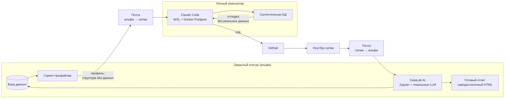

# Аналитический продукт через воздушный зазор

**Материал для презентации.** Ниже — послайдовый сценарий: у каждого слайда есть
заголовок, тезисы на экран и заметки докладчику.

> **О цифрах.** Все количественные показатели взяты из репозитория проекта и
> проверены командами (`wc -l`, `grep -c`, `git rev-list`). Показателей закрытого
> контура — объёмов, названий территориальных банков, идентификаторов метрик — в этом
> файле нет намеренно: он покидает периметр, а весь проект построен ровно на том, что
> данные периметр не покидают. Места, где такие числа уместны в докладе, помечены
> `<!-- вписать -->` — их дописывают руками уже внутри контура.

---

## Слайд 1. Титул

# Промышленный дэшборд, собранный через воздушный зазор

**Один человек. ИИ-агент, который никогда не видел данных. Продукт, работающий на
проме.**

*Заметки докладчику.* Начать с парадокса: агент, писавший этот код, не имел и не мог
иметь доступа к данным — ни к строке, ни к значению. Тем не менее написанный им SQL
работает на промышленной базе. Дальше — как это устроено.

---

## Слайд 2. Задача и ограничение

### Что мешает делать аналитику быстро

- Данные живут в **закрытом контуре без интернета**. Современные ИИ-инструменты — снаружи.
- Наружу нельзя выносить данные. Внутрь нельзя пустить внешний сервис.
- Обычный выход — писать код руками внутри контура: медленно, и ревьюить некому.

### Ключевая идея

> Через границу переносится **структура данных**, а не данные.
> Этого достаточно, чтобы агент снаружи написал работающий код.

*Заметки докладчику.* Подчеркнуть: это не обход ограничения, а работа в его логике.
Ограничение остаётся в полной силе — меняется то, что именно мы через границу носим.

---

## Слайд 3. Направление «наружу»: профиль вместо данных

```
БД закрытого контура
      ↓
скрипт-профайлер
      ↓
профиль данных: структура, типы, статистика,
чувствительные поля замаскированы
      ↓
почта: альфа → сигма
      ↓
личный компьютер
```

**Что реально уносится**

| Показатель | Значение |
|---|---|
| Таблиц описано | 10 |
| Колонок описано | 264 |
| Из них помечено чувствительными | 38 |

В профиле по каждой колонке: тип, доля непустых, число уникальных, границы значений,
категории, примеры. **У чувствительных полей список примеров пуст** — маскирование
происходит до того, как файл покидает контур.

*Заметки докладчику.* Показать фрагмент профиля: у обычной колонки видны примеры
значений, у колонки с идентификатором организации — пустой список. Именно эта
асимметрия и делает вынос безопасным.

---

## Слайд 4. Направление «внутрь»: код

```
личный ПК: Claude Code + WSL + Docker с Postgres
      ↓
GitHub
      ↓
рабочий ноутбук (сигма)
      ↓
почта: сигма → альфа
      ↓
DataLab AI: Jupyter + локальные LLM + доступ к БД
      ↓
запуск проекта
```

Внутри контура проект обращается к **двум** локальным ресурсам:

- **база данных** — источник всех расчётов;
- **локальная LLM** — разбор свободного текста и формулировка выводов.

Ни один внешний сервис при запуске не вызывается: готовый отчёт — самодостаточный
HTML-файл без единого обращения в сеть.

*Заметки докладчику.* Обратить внимание: путь внутрь длинный и ручной, но он проходится
**один раз на версию**, а не на каждый запуск. Внутри контура запуск — одна ячейка.

---

## Слайд 5. Полный цикл



*Заметки докладчику.* Провести пальцем два круга: верхний — структура наружу, нижний —
код внутрь. Точка замыкания — синтетическая база: она построена по профилю и позволяет
проверить код до того, как он попадёт в контур.

---

## Слайд 6. Почему код переносится без правок

### Одна кодовая база работает в обоих контурах

Между контурами меняются ровно **две** вещи:

1. строка подключения к базе;
2. backend локальной LLM.

Всё остальное — общее. Схема и имена таблиц в синтетической базе повторяют
промышленные **точь-в-точь**, поэтому SQL переносится буквально: ни одного условия
вида «если пром — то иначе».

```
uzp_dash/            ядро, не знает про контур
  db.py                единая точка доступа к БД
  llm.py               единая точка вызова LLM
  dashboards/<имя>/    queries · analyze · forecast · prompts · view
synth/               генерация синтетики (нужна только снаружи)
```

**24 файла Python, 7 559 строк.** Ядро — 7 модулей.

*Заметки докладчику.* Это главный технический вывод: контур-специфичного кода нет
вообще. Если бы он был, каждая правка требовала бы двух проверок — а вторую, на проме,
сделать негде.

---

## Слайд 7. Синтетика: отладка без единой реальной записи

Профиль данных → генератор → база, статистически похожая на промышленную.

Генератор не просто заполняет таблицы случайными числами, он **воспроизводит бизнес-
инварианты**:

- сезонные организации, которые зачисляют только летом;
- клиенты, оттекающие два месяца подряд;
- клиенты, у которых отток был год назад, а потом они вернулись;
- частичная ведомость текущего месяца — как на проме;
- сотрудник с двумя сделками на один и тот же месяц.

**1 105 строк генератора** — это цена возможности проверить логику до контура.

> Каждая ветка алгоритма должна встретиться в синтетике, иначе она поедет на пром
> непроверенной.

*Заметки докладчику.* Пример: пока в синтетике не было организаций с сезонным
возвратом, соответствующая ветка прогноза ни разу не выполнялась — и ошибка в ней не
проявилась бы до прома.

---

## Слайд 8. Агент пишет не «select \*», а промышленный SQL

**28 запросов** в проекте. Четыре примера того, что агент учитывает сам.

### 1. Диалект целевой СУБД

```sql
-- НЕЛЬЗЯ: ядро 9.4 разбирает «=>» как оператор
make_interval(months => n)          -- ошибка: column "months" does not exist

-- НАДО: умножение интервала
n * interval '1 month'
```

Именованные аргументы появились в PostgreSQL 9.5, а промышленная СУБД стоит на ядре
9.4. Ошибка воспроизводится только на проме. Причина записана комментарием прямо в
код — чтобы конструкция не вернулась при следующей правке.

### 2. Разрешение месяца без года

```
off = (номер_месяца_плана − месяц(опорный) + 12) % 12
принимаем, только если off ≤ 2
```

В источнике месяц хранится номером без года. Сдвиг считается по модулю, а строки с
неразрешимым месяцем **не молчат**: их доля попадает в диагностику.

### 3. Бизнес-правило внутри агрегата

```sql
min(outflow_unpaid_m_qty)   -- а не max и не sum
```

У организации в месяце обычно две выплаты — аванс и основная. Отток считается по итогу
**обеих**: если сотрудник получил деньги хотя бы на одну из дат, он не отток. Тот же
класс правил — сравнение факта привлечения с агрегатом по сотруднику, а не по каждой
сделке отдельно: один сотрудник может завести две сделки на один месяц.

### 4. Объём как проектное ограничение

Помесячные активности за 13 месяцев агрегируются **на стороне базы** и не тянут тексты:
в память ядра Jupyter полная выборка не поместилась бы.

*Заметки докладчику.* Это ответ на вопрос «а не проще ли написать SQL самому». Каждый
из четырёх пунктов — не синтаксис, а знание предметной области и среды. Агент носит
это знание между сессиями, человек — нет.

---

## Слайд 9. Что получилось: дэшборд `tb_health`

Отчёт для управляющего: **не «что произошло», а «что делать»**.

| Блок | Содержание |
|---|---|
| Вердикт | Прогноз выполнения плана на текущий, ещё не закрытый месяц |
| Водопад | Из чего складывается прогноз: портфель − отток + приход + пайплайн |
| Матрица | Тепловая карта «подразделение × сегмент» по прогнозу |
| Карточки | По каждому подразделению: что конкретно сделать, с раскрытием по клику |
| Список работ | Организации, закрывающие план: поиск, фильтры, цель по перевыполнению |
| Выводы LLM | Свой вывод после каждого раздела, не один общий |

**Три уровня в одном файле:** банк → территориальный банк → подразделение, с
переключением между ними.

Прогноз не берётся из витрины — он **считается**: модель оттока по истории (устойчивый,
сезонный, разовый), стыковка с фактом ежедневной витрины, пайплайн с коэффициентом
реализуемости у каждого подразделения.

*Заметки докладчику.* Показать сам файл. Обратить внимание на клик по карточке —
раскрывается разбор «почему прогноз такой», с группировкой оттока по причине.

---

## Слайд 10. Проверяемость: расчёт, который можно оспорить

### `methodology.md` — 1 094 строки

- каждая величина выведена формулой и SQL-запросом;
- приложен способ воспроизвести пример из синтетики;
- перечислены **известные расхождения и ограничения** — отдельным разделом.

> Отчёт, в котором нельзя проверить число, — это презентация, а не аналитика.

Встроенные проверки в самом коде: водопад обязан сходиться в ноль, группы обязаны
покрывать блок целиком, сумма по частям обязана совпадать с итогом. Расхождение не
прячется — оно печатается в прогресс генерации.

*Заметки докладчику.* Отдельно сказать про раздел «ограничения»: там честно написано,
где расчёт слабее — например, что уровни витрины не сходятся между собой и почему это
показано строкой «прочие», а не спрятано.

---

## Слайд 11. Как это делалось раньше: генерация «по семплу»

```
Человек пишет SQL и выгружает данные в файл
      ↓
LLM по образцу генерирует HTML-страницу
      ↓
На странице — кнопка «Загрузить файл»
      ↓
Пользователь подгружает файл целиком
      ↓
Страница рисует то, что в файле
```

Работает. Выглядит красиво. Быстро собирается.

*Заметки докладчику.* Важно не обесценивать прошлый подход — он решал свою задачу и
решал её быстро. Дальше речь о том, где у него потолок.

---

## Слайд 12. Три слабости прошлого подхода

### 1. Нет LLM-обработки данных и выводов

LLM участвует один раз — когда рисует страницу. Дальше она не видит ни данных, ни
результата. Свободный текст — комментарии, анкеты, переписка — не читается никем.

**Сейчас:** локальная LLM читает свободный текст активностей по каждой организации и
формулирует вывод после каждого раздела отчёта. Названия организаций и география в
промпт не уходят — подставляются псевдонимы, реальные имена возвращаются в ответ уже
на нашей стороне.

### 2. Нет доступа к базе — данные грузятся из файла

Файл устаревает в момент выгрузки. Пересчитать нельзя — только выгрузить заново.
Разрез, который не выгрузили, посмотреть невозможно.

**Сейчас:** прямое подключение к базе контура, 28 запросов, расчёт на актуальных данных
при каждом запуске. Отчёт можно пересобрать за прошлый месяц одним параметром.

### 3. Скрипты выгрузки пишет человек

Каждый разрез — это ручной SQL. Знание диалекта и бизнес-правил живёт в голове
конкретного аналитика и уходит вместе с ним.

**Сейчас:** SQL пишет агент — с учётом диалекта СУБД, ограничений по объёму и бизнес-
правил предметной области (слайд 8). Знание зафиксировано в коде и комментариях.

*Заметки докладчику.* Третий пункт — самый недооценённый. Показать комментарий про
ядро 9.4: это знание, которое иначе теряется между людьми и проектами.

---

## Слайд 13. Сравнение

| Признак | «По семплу» | Агент + контур |
|---|---|---|
| Источник данных | Файл, выгруженный вручную | Прямое подключение к БД |
| Актуальность | На момент выгрузки | На момент запуска |
| Роль LLM | Нарисовать страницу один раз | Читать текст и формулировать выводы при каждом запуске |
| Кто пишет SQL | Человек, каждый раз | Агент, знание зафиксировано в коде |
| Новый разрез | Новая выгрузка + новая страница | Параметр в тетрадке |
| Проверяемость числа | Доверие к выгрузке | Формула, SQL и встроенные проверки сходимости |

---

## Слайд 14. Что предлагаю: упаковать подход в skill

### Проблема

Каждый, кто захочет повторить путь, соберёт обвязку заново: подключение, вызов LLM,
правила под диалект, структуру проекта. Это недели, и результат у каждого свой.

### Решение — skill для закрытого контура

**1. Подключение**
- единая точка доступа к базе контура;
- единая точка вызова локальных LLM;
- параметры подключения и **выбор модели — в ячейке Jupyter**, не в коде.

**2. Правила написания кода**
- диалект целевой СУБД: что использовать нельзя и чем заменять;
- ограничения по объёму: что агрегировать на стороне базы;
- что запрещено отправлять в LLM и как обезличивать.

**3. Запуск**
```python
TB = "…"                 # разрез
REPORT_MONTH = "2026-07" # период
LLM_MODEL = ""           # пусто → модель из настроек
```
Одна ячейка. Параметры сверху, никакой правки кода.

### Что это даёт

> Аналитик описывает **задачу**, а не инфраструктуру.
> Путь, который здесь пройден один раз, становится воспроизводимым для любого.

*Заметки докладчику.* Финальный тезис: ценность не в конкретном дэшборде, а в том, что
маршрут пройден и его можно упаковать. Дэшборд — доказательство, что маршрут рабочий.

---

## Приложение. Проверенные показатели проекта

| Показатель | Значение |
|---|---|
| Файлов Python | 24 |
| Строк Python | 7 559 |
| Модулей ядра | 7 |
| SQL-запросов | 28 |
| Строк в модуле запросов | 540 |
| Строк генератора синтетики | 1 105 |
| Строк методологии | 1 094 |
| Профилей таблиц | 10 |
| Колонок в профилях | 264 |
| Чувствительных колонок (замаскированы) | 38 |
| Коммитов | 26 |

Показатели закрытого контура — объёмы, названия подразделений, идентификаторы метрик —
в этом файле отсутствуют намеренно. <!-- вписать при необходимости внутри контура -->
